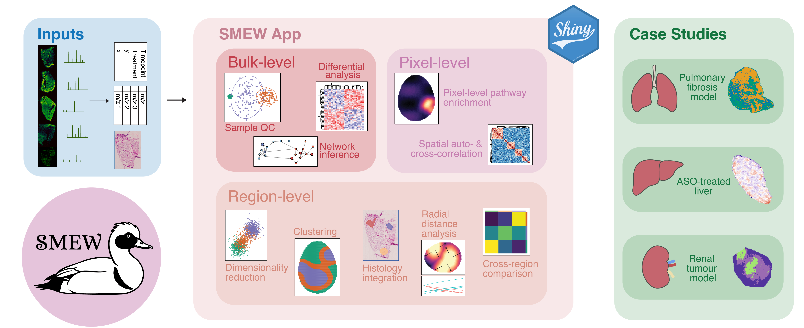
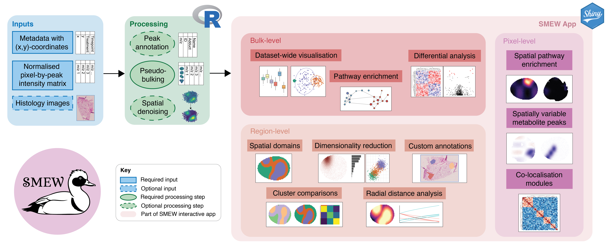
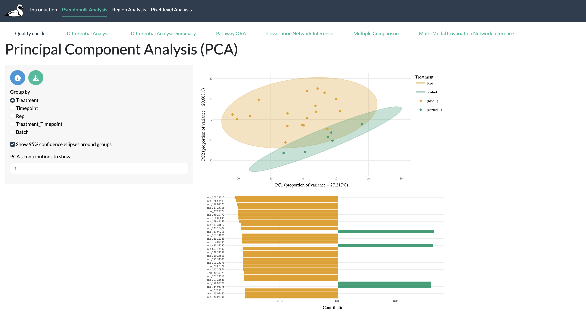
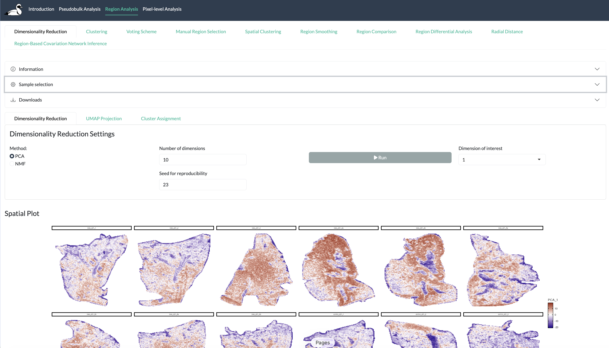
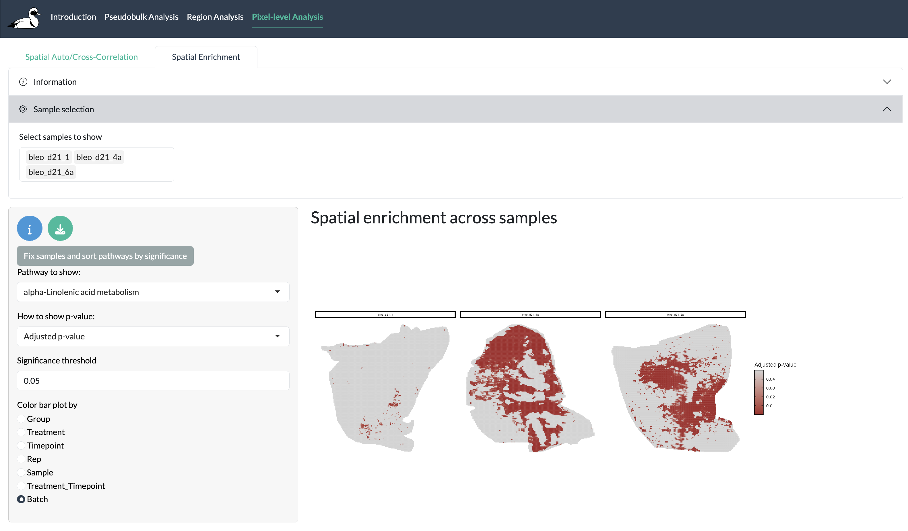

# SMEW: Spatial metabolomics enhanced workflow 



Spatial metabolomics, measured through mass spectrometry imaging (MSI), provides high-throughput, spatially resolved information on metabolite distributions within tissues. This offers a direct readout of cellular biochemical activity and phenotype not fully captured by transcriptomics or proteomic profiling. However, inferring biologically meaningful patterns from noisy, high-dimensional MSI data, particularly across multiple samples and complex experimental designs, remains challenging, and often requires substantial programming expertise.  

Here we introduce SMEW (Spatial Metabolomics Enhanced Workflow), a flexible, interactive and shareable Shiny-based platform designed to enable code-free downstream analysis of spatial metabolomics MSI data. SMEW provides a unified environment for hierarchical analysis across bulk-, region- and pixel-level resolutions, allowing users to compare experimental conditions like disease or treatment groups, identify coherent metabolic patterns and link these patterns to biological pathways. The workflow leverages local spatial covariation to robustly summarise MSI data through dimensionality reduction, clustering, identification of spatially variable metabolites, co-localisation and covariation network analysis, and spatially-resolved pathway enrichment within a single interface.  

SMEW is applicable across MSI technologies and mass resolutions, as illustrated through case studies on DESI and MALDI-ToF datasets from lung, liver, and kidney. By complementing existing MSI processing and visualisation tools with an accessible, multi-sample, and biologically interpretable analysis framework, SMEW enables functional, flexible, rigorous and intuitive exploration of spatial metabolomics datasets.  

## Installation

To use *smew*, you need R >= 4.0. *smew* will be made available on CRAN in due course but currently *smew* can only be installed from GitHub, either by cloning the repository and using *devtools::install()* or using *devtools::install_github("Core-Bioinformatics/smew")*. You need to make sure all dependencies are installed using the following:

### Required CRAN packages (use *install.packages()*) ###

* bsicons
* bslib
* ClustAssess
* data.table
* dendextend
* dplyr
* dunn.test
* DT
* ggplot2
* ggplotify
* ggnewscale
* ggrepel
* ggVennDiagram
* ggrastr
* harmony
* heatmaply
* htmlwidgets
* igraph
* jpeg
* Matrix
* matrixStats
* patchwork
* pbapply
* plotly
* RColorBrewer
* RcppML
* reshape2
* scales
* shiny
* shinyjqui
* shinyjs
* shinyWidgets
* stringr
* tibble
* tidyr
* UpSetR
* viridis
* visNetwork

### Required Bioconductor packages (use *BiocManager::install()*) ###

* BayesSpace
* BiocSingular
* GENIE3
* mixOmics
* S4Vectors
* scater
* scran
* SingleCellExperiment

### Other package suggestions

To download plotly outputs to file, you may also need to run *webshot::install_phantomjs()*

## Input structure

To create a shiny app using *smew*, you need a processed (e.g. normalised) table of per-pixel peak intensities and a corresponding metadata table with spatial coordinates, both saved as CSVs. 

The intensity matrix is expected to have rows correspond to pixels (named by pixel_id in the first column) and the remaining columns correspond to peaks (named by m/z value).

For example, your intensity matrix may look something like:

| pixel_id |m/z 101.2345   |  m/z 102.85754 | m/z 303.35855   | m/z 344.48575  | m/z 321.38583  | m/z 112.28485 |
|:---:|:---:|:---:|:---:|:---:|:---:|:---: |
| pixel_1| 5774.812  | 675.361  | 23.555  | 8444.958  | 777.234  | 20.332  |
| pixel_2| 8794.013  | 444.523  | 81.294  | 6775.393  | 899.284  | 10.275  |
| pixel_3| 6777.358  | 857.585  | 14.326  | 9468.367  | 747.385  | 24.521  |
| | ...  | ...  | ...  | ...  | ... | ... |

The first column of the metadata table must match the row names of the intensity matrix, named *pixel_id*, followed by *x* and *y* columns containing spatial coordinates. There must be another column Sample which describes the sample a pixel corresponds to. Other columns can contain sample-wide information (e.g. treatment group) and other metadata information containing individual pixel information. 

| pixel_id    | Sample   | Treatment | Fibrotic |
| :---:        | :---:       | :---:   | :---: |
| pixel_1 | sample_1        | treatment_1 | normal |
| pixel_2 | sample_1        | treatment_1 | normal |
| pixel_3 | sample_1       | treatment_1 | fibrotic |
| pixel_4 | sample_2       | treatment_1 | fibrotic |
| pixel_5 | sample_2       | treatment_1 | normal |
| pixel_6 | sample_2       | treatment_1 | fibrotic |
| | ...  | ...  | ...  | 

You can optionally also include multi-modal data at bulk-level with features (e.g. genes, proteins etc.) on rows and samples (which must match entries in the metadata Sample column) on columns like follows:

| id    | sample_1   | sample_2 | sample_3 |
| :---:        | :---:       | :---:   | :---: |
| gene_1 | 23.4        | 13.3 | 77.9 |
| gene_2 | 60.7        | 56.9 | 43.1 |
| gene_3 | 113.4       | 100.8 | 112.2 |
| gene_4 | 12.5       | 10.8 | 46.7 |
| gene_5 | 89.9       | 50.3 | 79.3 |
| gene_6 | 54.4       | 30.9 | 46.0 |
| | ...  | ...  | ...  | 

## App creation

Once your data is in the format described above, you can create an app in just 1 line of code. In this case, suppose you have data from mouse in negative ion mode. In this case we only want to include peaks which can be annotated as known metabolites.

```{r}
library(smew) 

create_smew_app(
  intensity_csv = 'testdata/intensity.csv', metadata_csv = 'testdata/meta.csv', 
  output_dir = 'test_app', 
  metabolite_table = 'path/to/metabolite_table.csv',
  pathway_table = 'path/to/pathway_table.csv',
  pathway_classification = 'path/to/pathway_classification.csv',
  adducts = 'M-H [1-]', 
  ion_mode = 'Negative', 
  only_annotated = TRUE)


#run shiny app
shiny::runApp('test_app/smew_app)
```

By default, the longer preprocessing steps for pixel-level enrichment and pixel-level autocorrelation steps will not be run but these can be triggered using the *run_pixel_enrichment* and *run_autocorrelation* parameters. More details about these processes is given in [name of vignette].

## App structure

Here we describe the structure of a SMEW app and the components of each section. For more details, see [our documentation](https://core-bioinformatics.github.io/smew/articles/smew.html).



### Introductory tabs

**Annotation:** Explore metabolite peak annotations and search for masses and/or metabolites of interest.

**Spatial Visualization:** Interactive spatial plots of metabolite peak intensities and metadata information.

---

### Bulk-level tabs



**Quality Control (QC):** Visualize and assess data quality at the whole sample level and compare intensity profiles, including PCA, PLS-DA, boxplots, and barplots across experimental conditions. Identify outliers or batch effects for downstream analysis.

**Differential Analysis (DA):** Perform pairwise comparisons between experimental conditions using parametric and non-parametric tests with multiple testing correction.

**DA Summary:** Summarise and visualize results from DA comparisons using heatmaps and volcano plots.

**Pathway ORA (if available):** Test for enrichment of differentially abundant peaks in known pathways using over-representation analysis based on a user-supplied pathway table.

**Covariation Network Inference:** Infer regulatory networks from sample-level data using GENIE3, with interactive network visualisation and comparison between multiple networks.

**Multi-modal Covariation Network Inference (if available):** Infer and compare regulatory networks across multiple sample groups using multi-modal data.

**Bulk Multi-Comparison:** Compare multiple conditions using ANOVA or Kruskal-Wallis tests with post-hoc analysis and cross plots.

---

### Region-level tabs



**Dimensionality Reduction:** Identify and visualize spatial patterns across multiple samples using PCA, NMF, and/or UMAP. Clusters can be created by thresholding the resulting dimensionality reductions or using individual peak intensities.

**Clustering:** Create spatial regions/clusters based on molecular profiles and visualize cluster assignments.

**Histology Integration:** Overlay molecular data with histological images to draw manual regions of interest.

**Voting Scheme:** Use thresholding on one or multiple metabolic features to create consensus regions or clusters.

**Spatial Clustering:** Perform spatial-informed clustering using BayesSpace.

**Spatial Smoothing:** Apply spatial smoothing to any regions identified through this app or outside to reduce noise and highlight spatially-resolved patterns.

**Cross-Cluster Comparison:** Compare different clustering and region-identification options to understand the overlap between regions.

**Region-Based Differential Analysis:** Compare multiple regions to find metabolite peaks driving regions, optionally taking into account experimental conditions.

**Radial Distance Analysis:** Analyse molecular changes as a function of distance from a reference point or region to find spatially-refined patterns.

**Region-Based Covariation Network Inference:** Infer covariation networks within specific tissue regions and compare regulatory relationships across regions.

---

### Pixel-level tabs



**SVM Identification (if available):** Identify metabolic peaks with distinct spatial patterns and groups of peaks with common spatial patterns using auto-correlation and cross-correlation metrics.

**Pixel Enrichment (if available):** Perform spatially-informed pathway enrichment analysis to identify regions with distinct metabolic changes.


