<div style="text-align: justify"> 

```{r options, include = FALSE}
knitr::opts_chunk$set(
  collapse = TRUE,
  comment = "##>"
)
```


SMEW (Spatial Metabolomics Enhanced Workflow) is a flexible, interactive, and shareable Shiny-based platform for code-free downstream analysis of spatial metabolomics MSI data. SMEW provides a unified environment for hierarchical analysis across bulk-, region-, and pixel-level resolutions, allowing users to compare experimental conditions like disease or treatment groups, identify coherent metabolic patterns, and link these patterns to biological pathways. The workflow leverages local spatial covariation to robustly summarise MSI data through dimensionality reduction, clustering, identification of spatially variable metabolites, co-localisation and covariation network analysis, and spatially-resolved pathway enrichment within a single interface.

SMEW is applicable across MSI technologies and mass resolutions. By complementing existing MSI processing and visualisation tools with an accessible, multi-sample, and biologically interpretable analysis framework, SMEW enables functional, flexible, rigorous and intuitive exploration of spatial metabolomics datasets.

In this tutorial we use the bleomycin-treated mouse lung dataset published in [Franzén et al.](https://www.nature.com/articles/s41588-024-01819-2) and [Williams et al](https://www.nature.com/articles/s41467-025-68003-w). Here we have DESI MSI data from mice 7 and 21 days after exposure to bleomycin (bleo) or a saline control (control). The example app described in this vignette can be found [here](add link to app). The data used in the app can be found [here](add link to data). In the package we also provide a very small example dataset to allow users to test the app and explore the workflow, but we recommend users to use their own data or larger example datasets to fully explore the capabilities of SMEW.


## Installation

To use *smew*, you need R >= 4.0. *smew* will be made available on CRAN in due course but currently *smew* can only be installed from GitHub, either by cloning the repository and using *devtools::install()* or using *devtools::install_github("Core-Bioinformatics/smew")*. You need to make sure all dependencies are installed using the following:

### Required CRAN packages

The required CRAN packages can be installed using the following code:
```{r cran_install, eval = FALSE}
packages.cran <- c("bsicons", "bslib", "ClustAssess", "data.table", "dendextend", 
                   "dplyr", "dunn.test", "DT", "ggplot2", "ggplotify", "ggnewscale", 
                   "ggrepel", "ggVennDiagram", "ggrastr", "harmony", 
                   "heatmaply", "htmlwidgets", "igraph", "jpeg", "Matrix", "matrixStats", 
                   "patchwork", "pbapply", "plotly", "RColorBrewer", 
                   "RcppML", "reshape2", "scales", "shiny", "shinyjqui", "shinyjs", 
                   "shinyWidgets", "stringr", "tibble", "tidyr", "UpSetR", 
                   "viridis", "visNetwork")
install.packages(packages.cran)
``` 

### Required Bioconductor packages

SMEW's Bioconductor dependencies can be installed using the following code:
```{r bioc_install, eval = FALSE}
if (!requireNamespace("BiocManager", quietly = TRUE))
    install.packages("BiocManager")
BiocManager::install(c("BayesSpace", "BiocSingular", "GENIE3", "mixOmics", 
                       "S4Vectors", "scater", "scran", "SingleCellExperiment"))
```

### Other package suggestions

To download plotly outputs to file, you may also need to run:

```{r webshot_install, eval = FALSE}
webshot::install_phantomjs()
```

## Input data formats

SMEW takes as input a peak intensity matrix and a metadata table. 

The intensity matrix should:

* Be saved as a CSV file 
* Rows should correspond to pixels, with row names as pixel IDs
* Columns should correspond to peaks, with column names as m/z values

The metadata table should:

* Be saved as a CSV file
* Contain a column named "Sample" which indicates the sample each pixel belongs to
* Contain a column named "x" which indicates the x-coordinate of each pixel
* Contain a column named "y" which indicates the y-coordinate of each pixel
* The first column should be called "pixel_id" and should match the row names of the intensity matrix

Here are some previews of the subset of the bleomycin dataset provided in the package:

```{r data_preview}
library(smew)
intensity_matrix = read.csv(system.file("extdata", "bleo_sub_intensity.csv", package = "smew"),
                            row.names = 1)
metadata = read.csv(system.file("extdata", "bleo_sub_meta.csv", package = "smew"))
print(intensity_matrix[1:5, 1:5])
print(metadata[1:5, ])
```

## Creating a SMEW app

### Default SMEW app creation

To create a SMEW app, you can use the `create_smew_app()` function. This function takes as input the paths to your intensity matrix and metadata CSV files, as well as an output directory where the app files will be saved. The function also has several optional parameters for data processing and analysis settings, which are described in the documentation. Here is an example of how to use the `create_smew_app()` function with the bleomycin dataset:

```{r create_app, warning = F}
create_smew_app(
  intensity_csv = system.file("extdata", "bleo_sub_intensity.csv", package = "smew"),
  metadata_csv = system.file("extdata", "bleo_sub_meta.csv", package = "smew"),
  output_dir = "test_app"
)
```


The default call to the function using parameters like above will create an app with all the bulk-level and region-level tabs except for those which require pathway enrichment inputs. In order to run annotation within SMEW, provide a `metabolite_table` (with `MetaboliteID`, `ExactMass`, `MetaboliteName`) together with adduct settings. In order to run pathway enrichment steps, also provide a `pathway_table` (with `PathwayID`, `PathwayName`, `MetaboliteIDs`). For a full guide on preparing these files, see the [custom database vignette](databases.html). You can run the annotation and enrichment setup like follows:

```{r create_app_anno, warning = F}
create_smew_app(
  intensity_csv = system.file("extdata", "bleo_sub_intensity.csv", package = "smew"),
  metadata_csv = system.file("extdata", "bleo_sub_meta.csv", package = "smew"),
  output_dir = "test_app",
  metabolite_table = 'databases/metabolite_masses.csv',
  pathway_table = 'databases/pathways.csv',
  pathway_classification = 'databases/pathway_classification.csv',
  adducts = c("M-H [1-]"),
  ion_mode = "Negative",
  ppm = 10,
  only_annotated = TRUE
)
```

This will run the annotation step using the specified adducts, ion mode, and ppm tolerance, and only keep annotated peaks for downstream analysis. You can also keep all peaks regardless of annotation status by setting `only_annotated = FALSE`.

You can also perform spatially-informed denoising of the data during app creation by setting `denoise = TRUE` in the `create_smew_app()` function. This will run the spatial denoising step of the workflow and create a denoised version of the intensity matrix which will be used for all downstream analysis in the app.

### Using your own annotations

If you have already run annotation externally to smew and have your own annotations, you can provide these using the `anno` parameter as follows:

```{r create_app_own_anno, eval = F}
annotations <- read.csv("path/to/your/annotations.csv")
create_smew_app(
  intensity_csv = system.file("extdata", "bleo_sub_intensity.csv", package  = "smew"),
  metadata_csv = system.file("extdata", "bleo_sub_meta.csv", package = "smew"),
  output_dir = "test_app",
  anno = annotations,
  pathway_table = "path/to/pathway_table.csv",
  pathway_classification = "path/to/pathway_classification.csv"
)
```

### Using spatial autocorrelation and pixel-level enrichment in app creation

By default, the `create_smew_app()` function does not run the spatial autocorrelation or pixel-level enrichment steps as these can be time consuming, but you can choose to run this steps by setting `run_autocorrelation = TRUE` and `run_pixel_enrichment = TRUE` respectively. For both of these steps, you can specify the number of cores to use for parallel processing using the `n_cores` parameter.

Setting `run_autocorrelation = TRUE` will enable the autocorrelation step and create the 'Spatially variable peaks' tab in the app. For the autocorrelation step, you can specify the number of top autocorrelated peaks to keep for downstream analysis using the `top_autocorrelated_peaks` parameter which will directly impact how long the cross-correlation step takes to complete.
```{r create_app_autocorrelation, eval = F}
create_smew_app(
  intensity_csv = system.file("extdata", "bleo_sub_intensity.csv", package = "smew"),
  metadata_csv = system.file("extdata", "bleo_sub_meta.csv", package = "smew"),
  output_dir = "test_app",
  run_autocorrelation = TRUE,
  top_autocorrelated_peaks = 10,
  n_cores = 4
)
```

Setting `run_pixel_enrichment = TRUE` will enable the pixel-level enrichment step and create the 'Spatial enrichment' tab in the app. In order for this to run, you must provide annotation with valid `metabolite_id` values (either via `anno` or internal annotation with `metabolite_table`) and also provide a `pathway_table`. For the pixel-level enrichment step, you need to specify the samples to use as controls for the enrichment analysis using the `enrichment_controls` parameter, which should be a character vector of sample names corresponding to the "Sample" column in your metadata and the samples to test against these controls using the `enrichment_comparisons` parameter, which should also be a character vector of sample names.

```{r create_app_pixel_enrichment, eval = F}
create_smew_app(
  intensity_csv = system.file("extdata", "bleo_sub_intensity.csv", package = "smew"),
  metadata_csv = system.file("extdata", "bleo_sub_meta.csv", package = "smew"),
  output_dir = "test_app",
  metabolite_table = "path/to/metabolite_table.csv",
  pathway_table = "path/to/pathway_table.csv",
  adducts = c("M-H [1-]"),
  ion_mode = "Negative",
  ppm = 10,
  run_pixel_enrichment = TRUE,
  enrichment_controls = c("d21_control_1", "d21_control_2", "d21_control_3"),
  enrichment_comparisons = c("d21_bleo_1", "d21_bleo_2", "d21_bleo_3"),
  n_cores = 4
)
```

Additional options for app creation include `histology_images_dir` which allows you to provide a directory of histology images corresponding to your samples to be used in the 'Manual region selection' tab of the app, `multi_modal_path` identifying bulk-level data from a different modality which can be integrated through the 'Multi-modal covariation network inference' tab, and `pathway_classification` for adding pathway category overlays in ORA visualisations. For more details on all the parameters of the `create_smew_app()` function, please refer to the documentation and to the [custom database vignette](databases.html), [multimodal vignette](multimodal.html), and [histology integration](histology.html) vignettes.

## Using your created SMEW app

Once you have created your SMEW app using the `create_smew_app()` function, you can run the app by calling (replacing with your selecting output directory):

```{r run_app, eval = F}
shiny::runApp("test_app/smew_app/app.R")
```

You can also the generated `app.R` file in RStudio and click "Run App". This will launch the Shiny app locally or you can also deploy the app on your selected Shiny server to share with collaborators and the community. 

The app provides an interactive interface for exploring your spatial metabolomics MSI data at multiple levels of resolution, including bulk-level, region-level, and pixel-level analyses. Here we provide a brief overview of the different tabs and functionalities of the app, starting with the introductory tabs. 

### Introductory tabs

The app begins with introductory tabs which introduce the pipeline and allowing users to explore peak annotations and intensities across space.

#### Annotation table

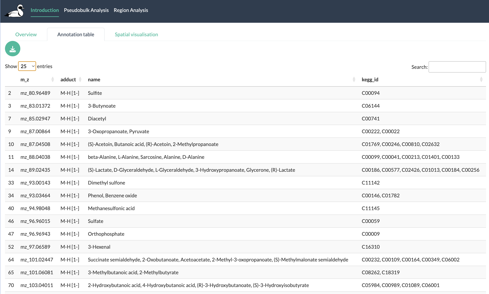

The annotation tab allows users to explore the annotations of their peaks if they have run the annotation step during app creation or provided their own annotations. Users can search and filter this table to find specific peaks and metabolites of interest. This tab provides a useful resource for referencing back to the annotations of peaks when exploring the results of downstream analyses in the app.

#### Spatial visualisation

The spatial visualisation tab allows users to explore the spatial distribution of peak intensities across their samples. Users can select specific peaks to visualise and can also adjust the colour scale, log transform the data and visualise the density plot of peak intensities. 

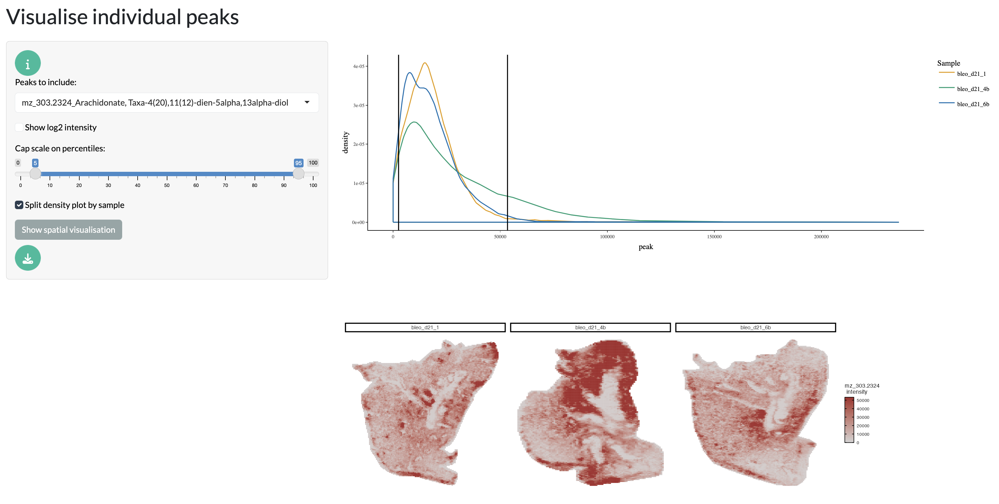

Further, multiple peaks can be overlaid as RGB channels to explore co-localisation patterns between peaks. This can be particularly useful for exploring the spatial relationships between metabolites of interest.

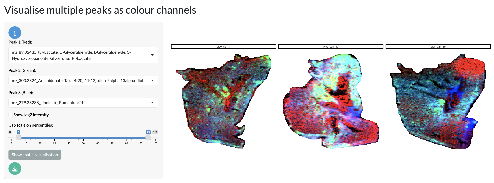

Finally, pixel-level metadata can be visualised, including any external annotations or experimental conditions associated with each pixel. This allows users to explore how different factors may influence the spatial distribution of metabolites.

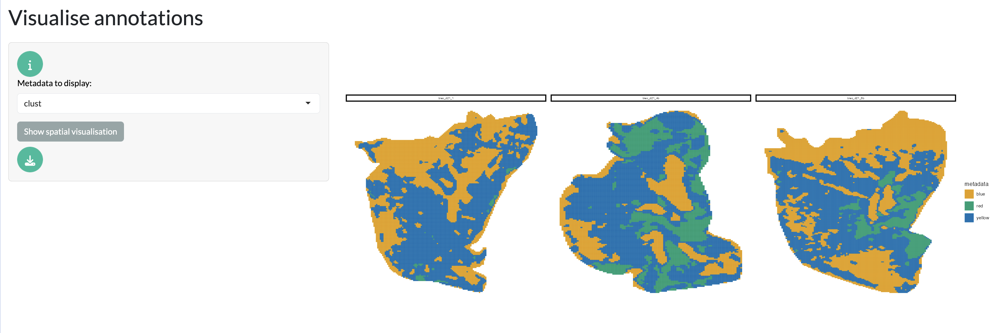

This tab provides a useful starting point for exploring the spatial characteristics of the data before diving into the more complex analyses in the downstream tabs.

### Bulk-level analysis tabs

The bulk-level analysis tabs allow users to explore their data at the sample level, comparing samples based on their overall metabolic profiles. This includes quality control, identification of differentially abundant peaks between conditions, performing pathway enrichment analysis to link metabolic changes to biological pathways and inference of covariation networks.

#### Quality checks

SMEW provides a QC tab where users can explore the quality of their data to understand dataset-wide patterns.

The full dataset can initially be visualised through unsupervised dimensionality reduction with PCA, where the first 2 components are shown with points and 95% confidence ellipses coloured by user-selected metadata variables. This allows users to explore how their samples cluster together based on their overall metabolic profiles and how this relates to experimental conditions or other metadata variables. The PC loadings can also be visualised to understand which peaks are driving the separation between samples in the PCA plot.

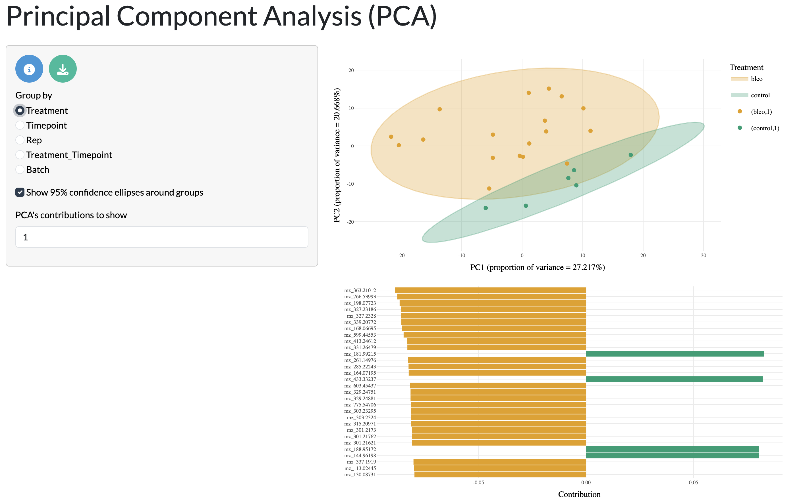

Further dataset-wide patterns can be explored through supervised dimensionality reduction with PLS-DA, where users can select the metadata variable used for the discriminant analysis. The first 2 components are shown with points and 95% confidence ellipses coloured by user-selected metadata variables. The PLS-DA loadings can also be visualised to understand which peaks are driving the separation between samples in the PLS-DA plot. This analysis allows users to explore how well samples from different conditions can be separated based on their metabolic profiles and which peaks are most important for this separation.

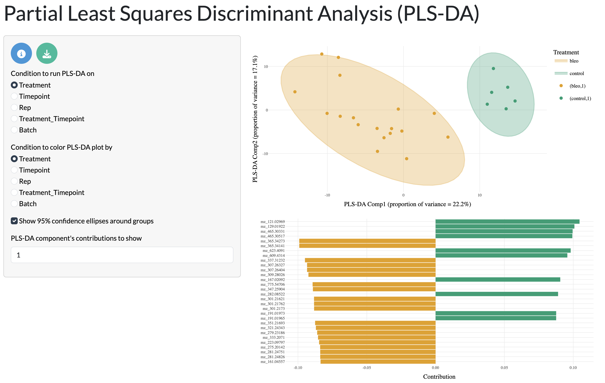

These dimensionality reductions enable users to explore the overall structure of their data, identify any potential outliers or batch effects, and understand how samples relate to each other based on their metabolic profiles. This can provide important context for interpreting the results of downstream analyses in the app.

Finally, users can explore the variation of individual peaks of interest across samples through bar plots and boxplots. The boxplots and bar plots can be coloured by metadata variables to explore how these relate to experimental conditions or other factors.

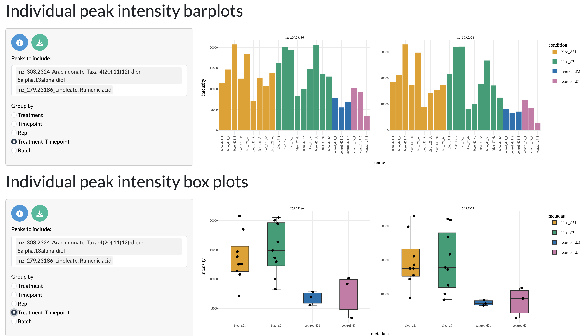

#### Differential analysis

Users can perform differential analysis between conditions at the sample level to identify peaks that are differentially abundant between conditions. This can be done using either t-tests or Wilcoxon tests, and users can specify the method and parameters for the analysis, including the log fold change and (BH-)adjusted p-value thresholds for significance. The results of the differential analysis can be explored using an interactive table, where peaks can be selected for much focused analysis in the next tab. 

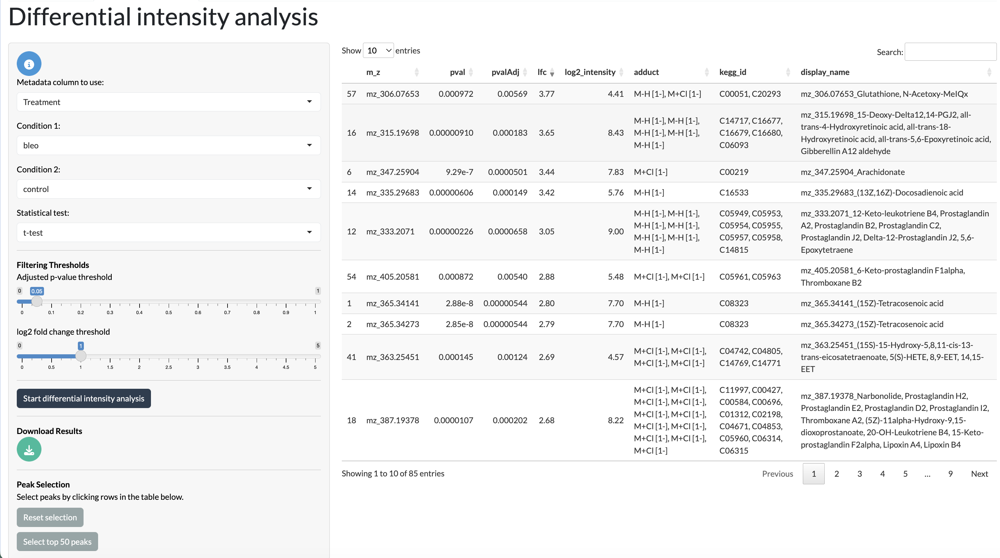

#### Differential analysis summary visualisation

The results of the differential analysis can be visualised through heatmaps and volcano plots, allowing users to explore the overall patterns of differential abundance across peaks and samples. The heatmap shows the log fold change of differentially abundant peaks across samples, allowing users to identify clusters of peaks with similar patterns of abundance across conditions. The volcano plot shows the relationship between log fold change and statistical significance for each peak, allowing users to identify peaks that are both highly differentially abundant and statistically significant.

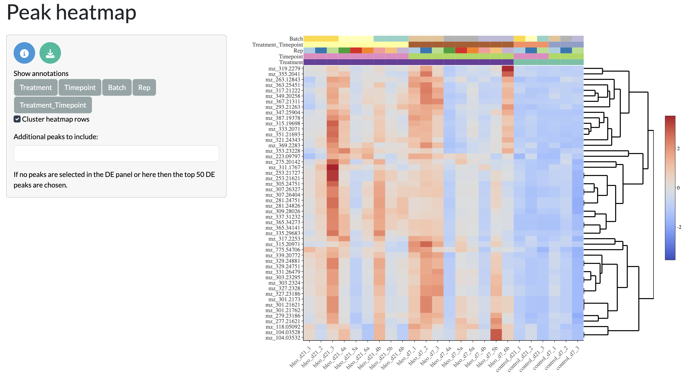
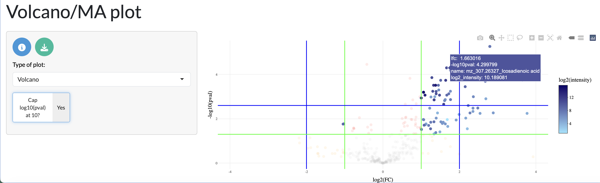

#### Pathway enrichment analysis (ORA)

Differentially abundant metabolite peaks can be linked to biological pathways through over-representation analysis (ORA) using a user-supplied pathway table. Only annotated peaks with valid metabolite IDs can be used for this purpose. The results of the ORA analysis can be explored through an interactive table and through visualisation of significant pathways in a volcano plot.

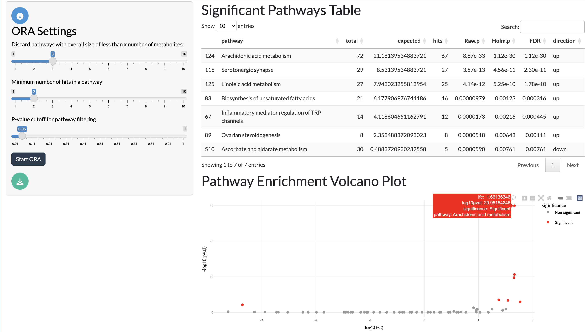

Significant pathways can then be divided by pathway categories (if a pathway classification table is supplied) and visualised in a network where nodes represent pathways and edges represent shared annotated peaks between pathways. This allows users to explore the relationships between significant pathways and identify clusters of related pathways that may be relevant to their biological question.

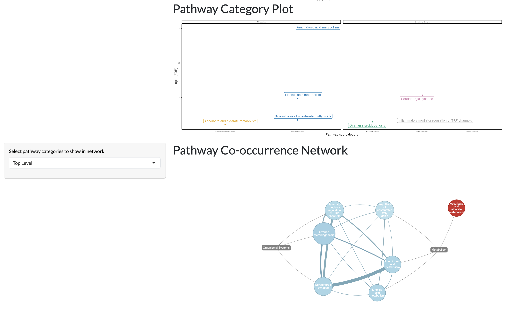

#### Covariation network inference

Relationships between metabolite peaks can be explored through covariation network inference using GENIE3. This allows users to identify pairs of peaks that show similar patterns of abundance across samples, which may indicate shared biological functions or regulatory relationships. Users can select a set of target peaks and the top n most covarying peaks with these targets will be identified and visualised in a network where nodes represent peaks and edges represent covariation relationships between peaks. Covariation networks across multiple sets of samples can be compared to identify relationships that are specific to certain conditions or shared across conditions. Target peaks are shown in blue, while overlapping peaks between networks are shown in green and non-overlapping peaks are shown in grey.

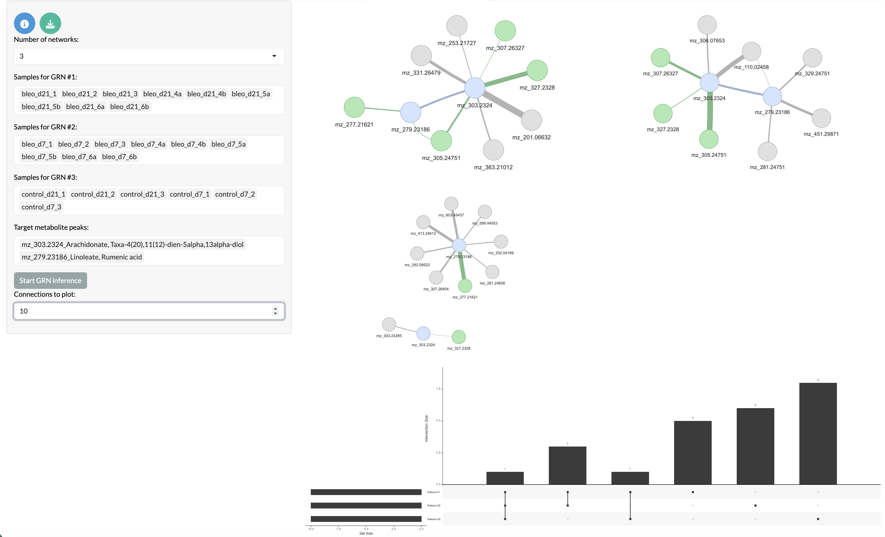

If users have bulk-level data from a different modality which they want to integrate with their MSI data, they can provide this during app creation and use the 'Multi-modal covariation network inference' tab to infer covariation networks between features in the MSI data and features in the bulk-level data. This allows users to explore relationships between different types of data and identify multi-modal patterns of variation that may be relevant to their biological question. Here the peak node colours remain the same as the previous network, while other modality targets are shown in light pink, overlapping other modality peaks are shown in dark pink and non-overlapping other modality peaks are shown in purple.

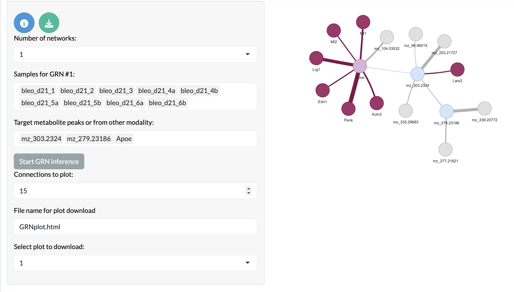

#### Multiple comparisons

A key feature of SMEW is allowing users to explore complex relationship in their dataset. For example, if users have more than 2 conditions in their data, they can perform multiple pairwise comparisons between conditions and explore the overlap of differentially abundant peaks and significant pathways between these comparisons. This allows users to identify peaks and pathways that are specific to certain conditions or shared across conditions, providing insights into the biological processes underlying the observed metabolic changes.

Firstly, significant changes across multiple conditions can be studied through ANOVA and Kruskal-Wallis tests. The results of these tests can be explored through an interactive table and post-hoc tests can be performed to identify specific pairs of conditions that show significant differences in peak abundance and visualised through box plots and significance grids.

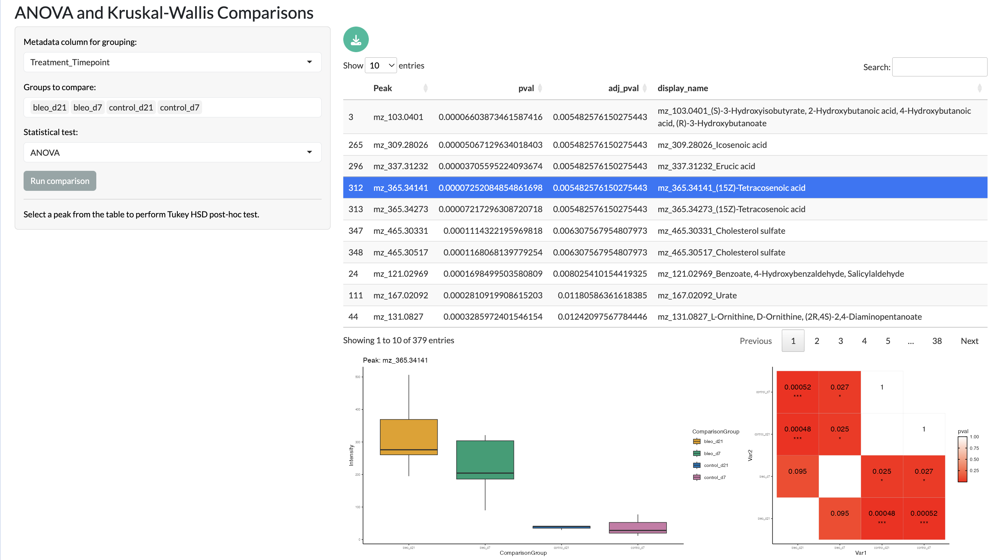

The top peaks in these comparisons can also be visualised in a heatmap to explore patterns of abundance across conditions and samples.

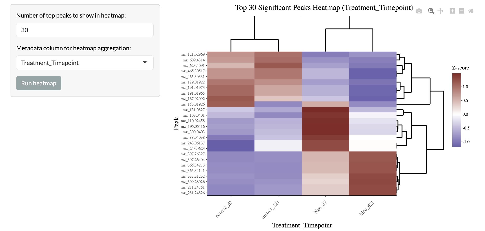

Further comparison of changes across multiple groups is enabled through log fold change heatmaps, allowing users to compare the direction and magnitude of changes across multiple pairwise comparisons. 

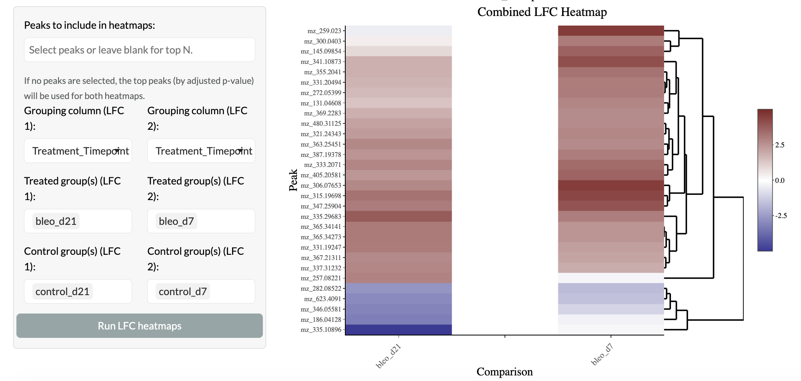

Finally, two pairwise comparisons can be directly compared through cross plots, where the log fold change of peaks in one comparison is plotted against the log fold change of the same peaks in another comparison. This allows users to identify peaks that show consistent changes across comparisons or that show different patterns of change across comparisons. The overlap of the two comparisons is then shown in a Venn diagram.

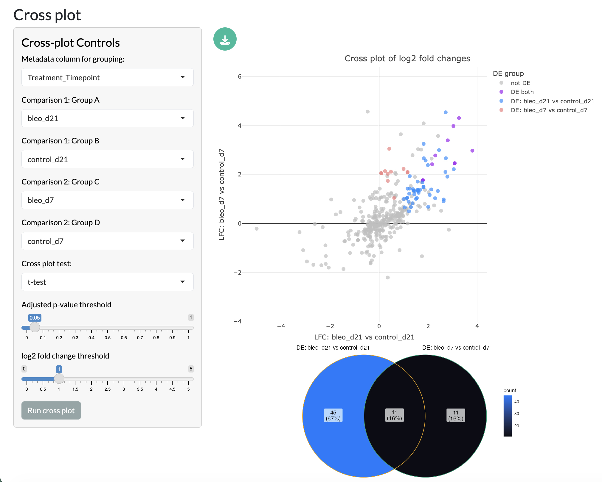

### Region-level analysis tabs

SMEW's region-level analysis tabs allow users to explore their data at the level of spatial regions, which can be defined through unsupervised clustering, combinations of peaks or manual selection. This allows users to identify spatial patterns of metabolic variation and link these to biological processes and pathways.

#### Dimensionality reduction

Firstly, key axes of variation at the pixel level can be identified through dimensionality reduction with PCA, non-negative matrix factorisation (NMF) and UMAP. This allows users to explore the overall structure of their data at the pixel level and identify clusters of pixels with similar metabolic profiles.

Firstly, PCA or NMF can be performed on a user-selected set of samples, using default data or log transformed data. Users can both select the total number of components/factors inferred then choose which to visualise across space, in the loadings plot and by variation across metadata groups.

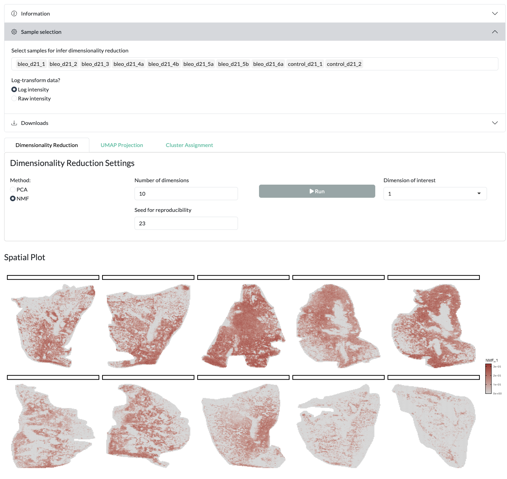
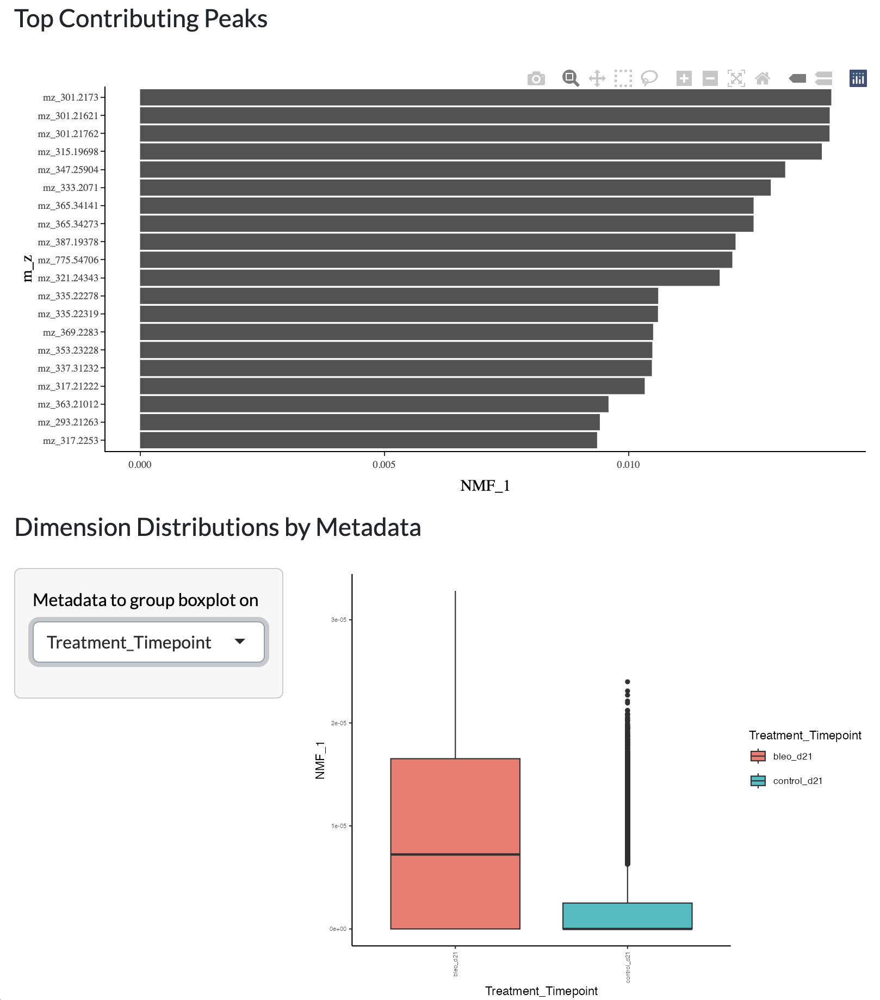

Using the resulting PCA/NMF, a non-linear dimensionality reduction with UMAP can be performed to further explore the structure of the data at the pixel level. The resulting UMAP can be visualised colouring by user-selected metadata or peak intensity or across space uisng a combined colouring across both components.

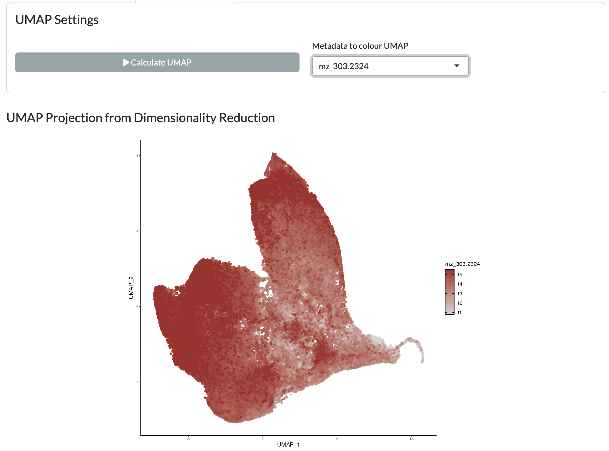
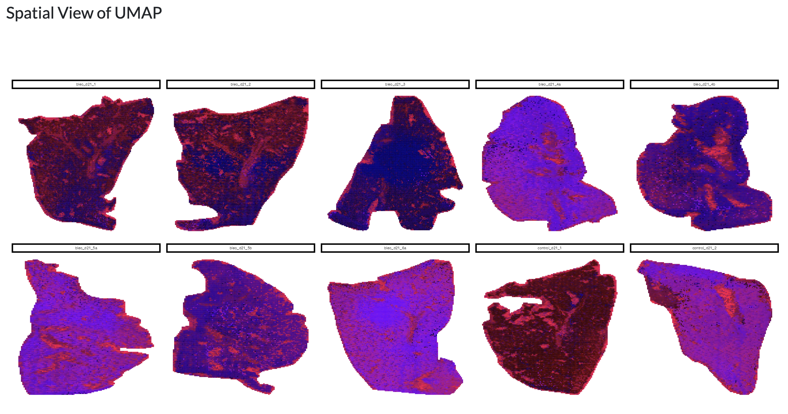

Finally, the resulting dimensionality reductions can be used to form spatial regions by thresholding. Users can choose which component and threshold to use to form these regions and visualise these across space. This allows users to identify spatial regions of metabolic variation. Using the "Add clusters to object" button, these regions can be added as a new column in the metadata which can then be used for downstream analyses in the app, using the name supplied by the user in the "Name for clusters" field.

#### Clustering

Data-driven clusters can be further identified through k-means or Louvain community detection clustering, on top of principal component analysis. Optionally, users can also apply batch correction through Harmony before clustering to mitigate potential batch effects in their data, selecting the metadata column to use for batch correction and the theta value, controlling the strength of the batch correction. Users can specify the number of clusters to identify and visualise these across space.

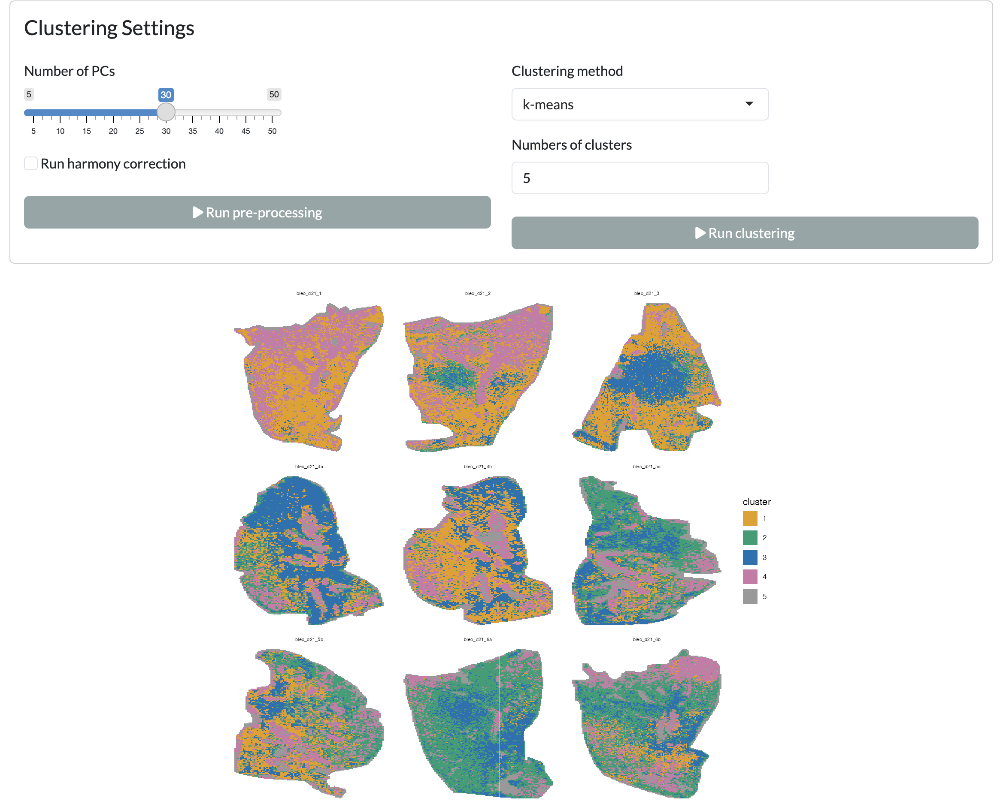

Again these clusters can be added as a new column in the metadata for downstream analysis in the app using the "Add clusters to object" button. 

#### Voting scheme

SMEW also offers more targeted approaches to region identification, allowing users to select specific peaks of interest and identify spatial regions where these peaks show consistent high intensity. This is done through a voting scheme, where users can select peaks of interest and specify the percentage of top pixels for each peak to consider as showing high intensity and how many of the selected peaks must agree. The resulting regions are then visualised across space and can be added as a new column in the metadata for downstream analysis in the app using the "Add clusters to object" button.

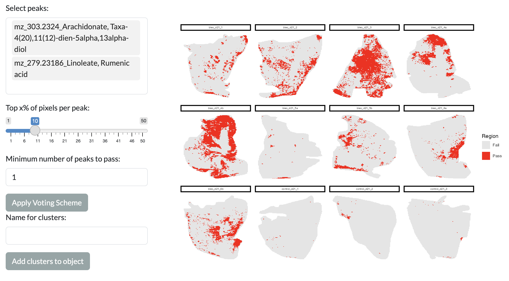

#### Manual region selection

Continuing with the targeted methodology, users can also manually draw regions of interest (ROIs) on the spatial plot to define spatial regions for downstream analysis. This allows users to leverage their prior knowledge of the tissue structure or other spatial features to define regions that are relevant to their biological question. Users can draw multiple ROIs and assign names to these ROIs, which will then be added as a new column in the metadata for downstream analysis in the app. If you have provided histology images during app creation, these will be available as the background for the spatial plot to aid users in drawing their ROIs. This allows users to define regions based on histological features, which can be particularly useful for exploring the spatial relationships between metabolic variation and tissue structure. If you do not have histology images, ensure you choose a non-empty feature to colour pixels by in the dropdown menu to provide some guidance for drawing ROIs.

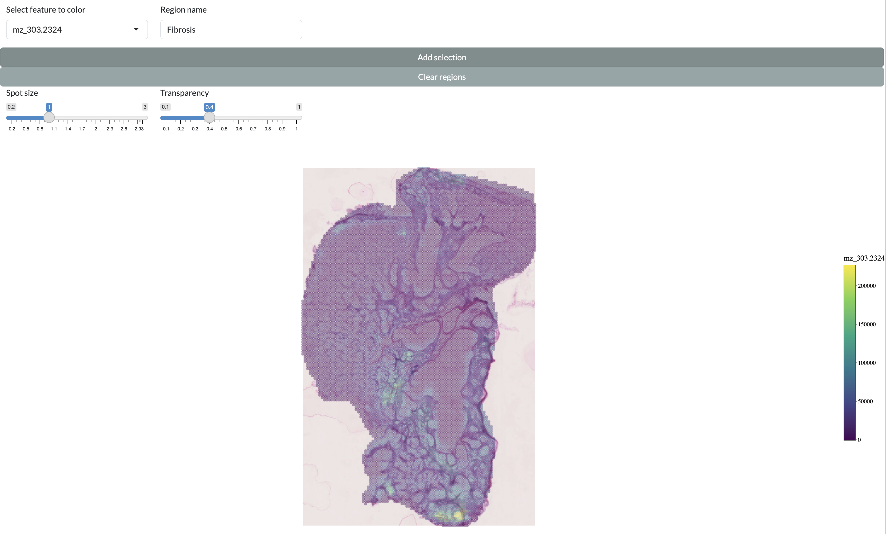

In order to select a region, draw around it with the lasso tool then enter a name in "Region name" and press "Add selection". The added regions will be shown on the individual sample and across the full dataset at the bottom of the page. You can then add these selected regions to the metadata for downstream analysis in the app by pressing the "Add clusters to object" button, which will add a new column to the metadata with the name supplied in the "Names for clusters" field and the values corresponding to the region names for pixels within the drawn regions and "Other" for pixels outside of these regions.

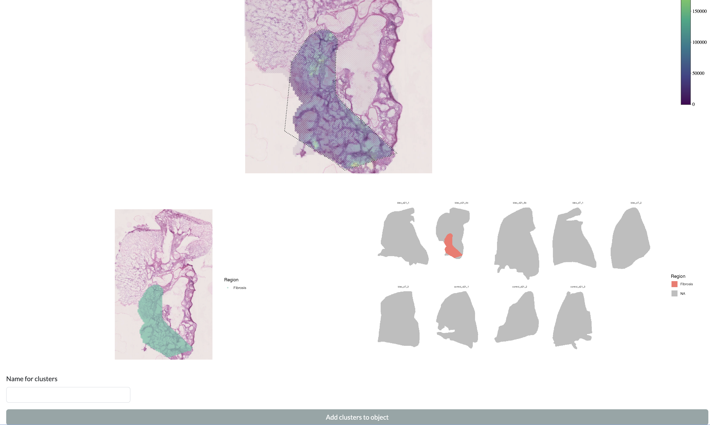

The images in this tab can take some time to render so don't worry if they don't appear straight away.

#### Spatial clustering

For spatially-informed clustering of MSI data, we currently implement the BayesSpace pipeline, which was originally developed for spatial transcriptomics data . This pipeline uses a Bayesian statistical model to identify spatial clusters of pixels with similar metabolic profiles, while accounting for spatial autocorrelation in the data. Users can specify the number of clusters to identify and visualise these across space. This clustering can only be performed separately per sample but we have added options to studying the correlation of clusters between samples to allow users to combine spatially-informed clusters across the full dataset. Users can select the number of clusters to infer per sample and the parameters passed to BayesSpace. The default parameters in the app were selected to avoid users being stuck with very long run times, but for optimal results these parameters may need to be adjusted based on the size and characteristics of the dataset and users should refer to BayesSpace documentation. 

Clusters can first be visualised per sample:
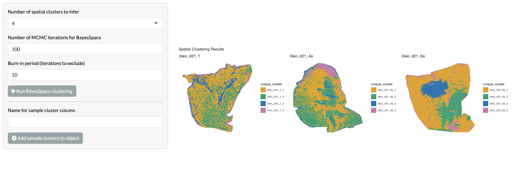

Users can then select a total number of clusters to identify across the full dataset, using the PCA across pseudobulked clusters and correlation heatmap provided. 
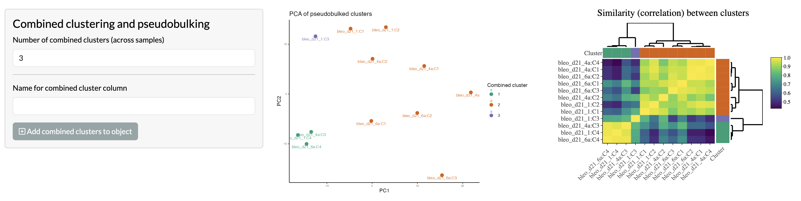

These clusters before and after combining across the dataset can also be added as a new column in the metadata for downstream analysis in the app.

#### Region smoothing

The remaining tabs in the region-level analysis section use the regions defined through the previous steps for downstream analysis. To mitigate potential noise in the data, users can perform region smoothing, where the region assignment of each pixel can be adjusted based on whether the majority of its neighbouring pixels are assigned to the same region. This can help to enhance spatial patterns and improve the robustness of downstream analyses. The smoothed data can then be visualised spatially and is automatically added to the metadata for downstream analysis.

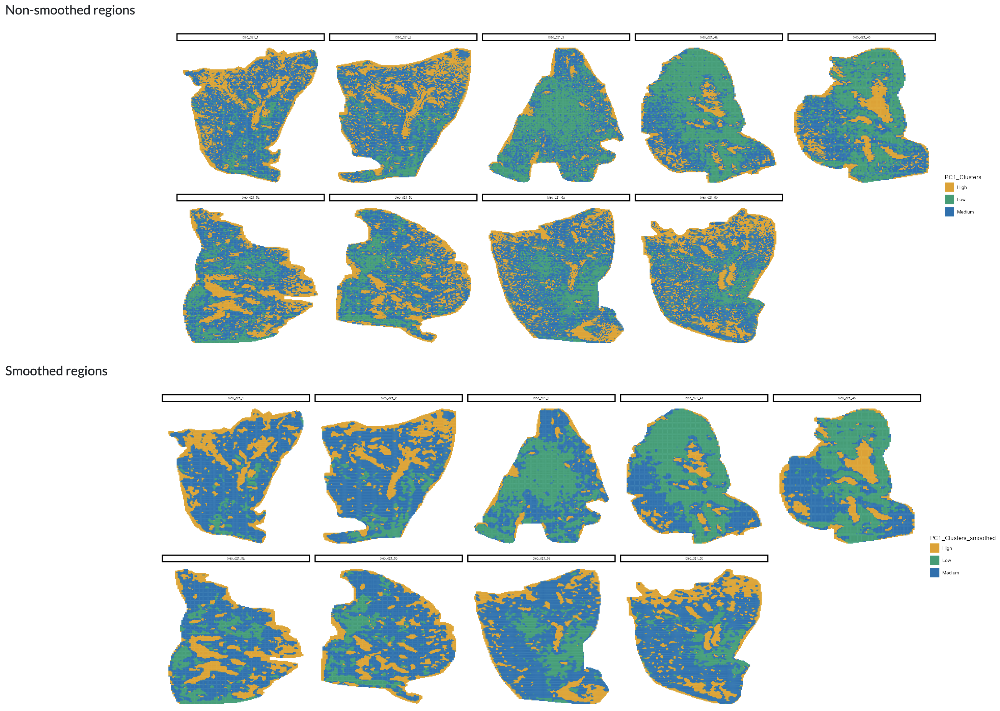

#### Region comparison

This tab enables users to compare different region and cluster identification methods. This can be done firstly by visualising the proportion of pixels per sample assigned to each region, grouped by user-supplied metadata columns.

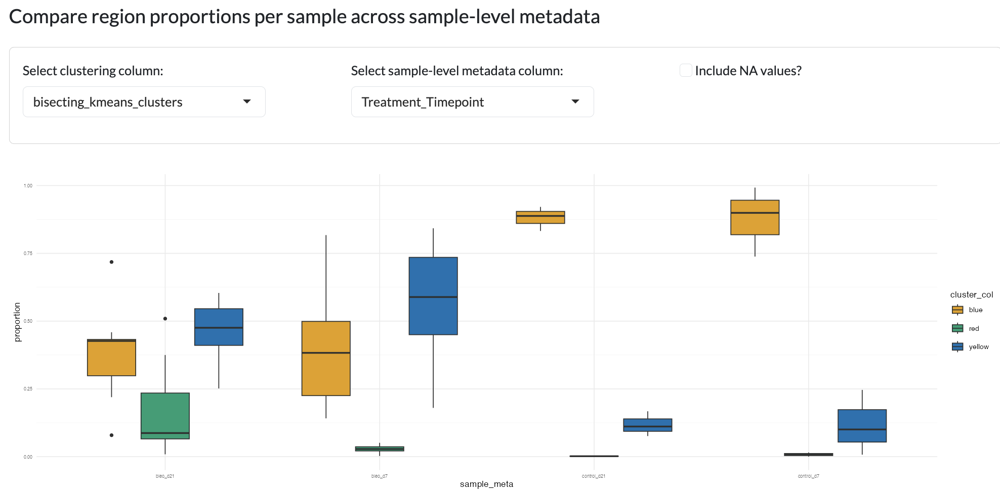

Different clustering or region identification methods can be compared to understand the relationships between different sets of regions through tile plots showing the number of overlapping pixels and Jaccard similarity index between clusterings and looking at the comparative proportions of regions (e.g. proportion of Clustering A cluster 1 that overlaps with Clustering B cluster 2 etc). This can help users to understand the relationships between different sets of regions and identify which method may be most appropriate for their data and biological question. In the case where the different region sizes are vastly different, you can scale the proportion plots to take the region sizes into account.

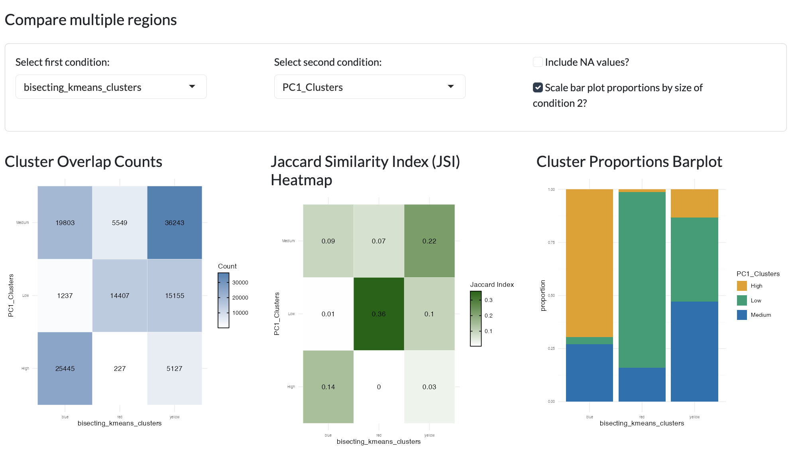

Finally, the element centric similarity score between different sets of regions can be calculated, which is a pixel-centric clustering similarity metric as described in [ClustAssess](https://github.com/Core-Bioinformatics/ClustAssess). You can view the distribution of similarity scores spatially to understand which regions are most similar and different between sets of regions.

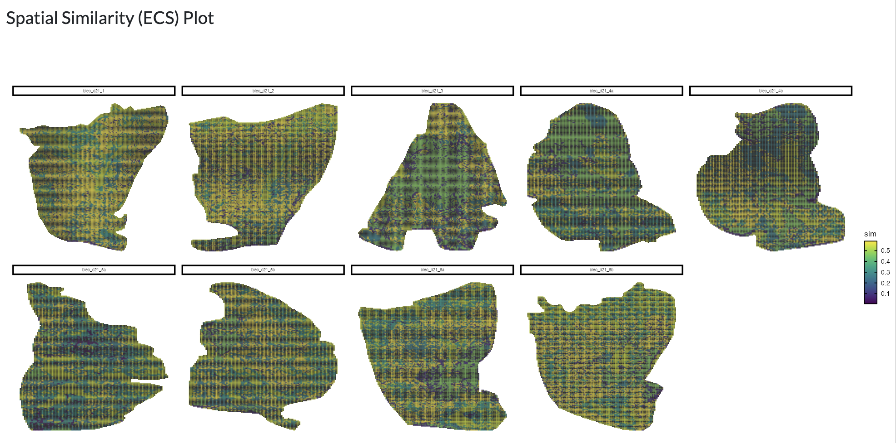

Identified clusters and regions that have been added to the object can be downloaded as CSV files for further analysis outside of the app using the "Download Updated Metadata" button.

#### Region differential analysis

Different regions can be compared to identify differentially abundant peaks between regions. This can be done using either t-tests or Wilcoxon tests, and users can specify the method and parameters for the analysis, including the log fold change and (BH-)adjusted p-value thresholds for significance. The results of the differential analysis can be explored using an interactive table. To reduce run-time and to avoid complications due to statistical dependencies between neighbouring pixels, this analysis is run at the pseudobulk level per region per sample. Users can also split this analysis by a selected metadata variable to perform comparisons within different groups of samples, for example comparing regions between conditions. Individual peaks can be selected from the interactive table for visualisation through boxplots.

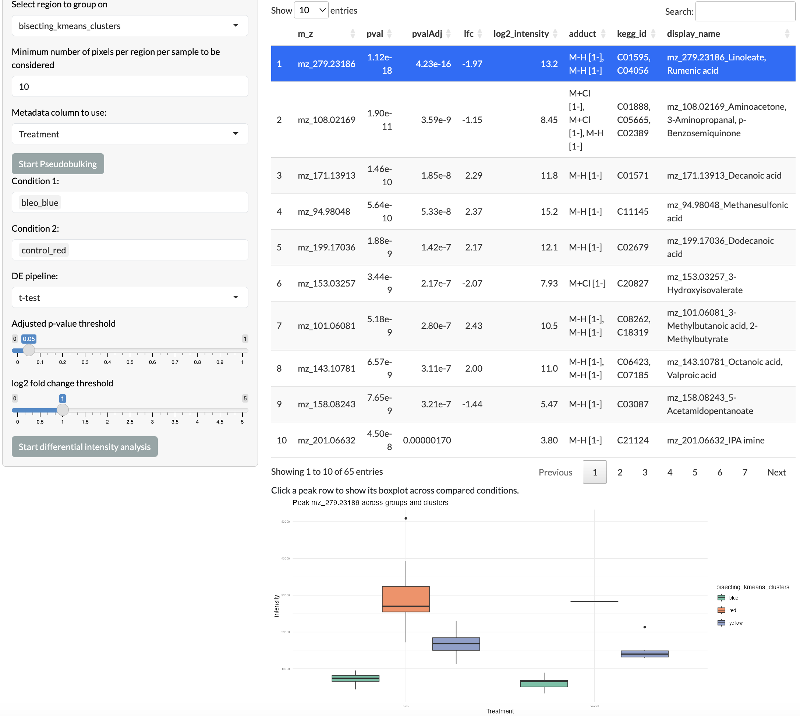

#### Radial distance

To further probe spatially-refined metabolic patterns, users can explore the relationship between peak intensities and radial distance from regions of interest. This allows users to identify peaks that show spatial gradients across the tissue, which may be relevant to spatially-organised metabolic activity. Users can select the region to use as the centre then calculate the distance of each pixel from this region. This distance was visualised spatially and the relationship between peak intensities and radial distance can be assessed through correlation analysis.

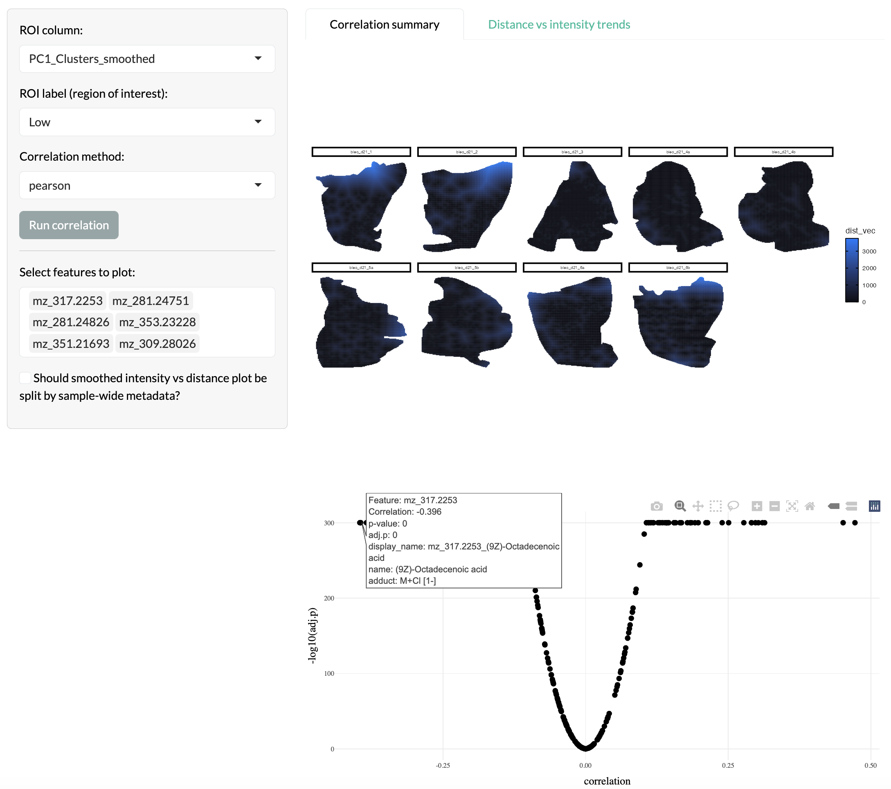

The variation of individual peak intensities can then be visualised through smoothed line plots to understand spatial gradients of metabolic variation across the tissue. 

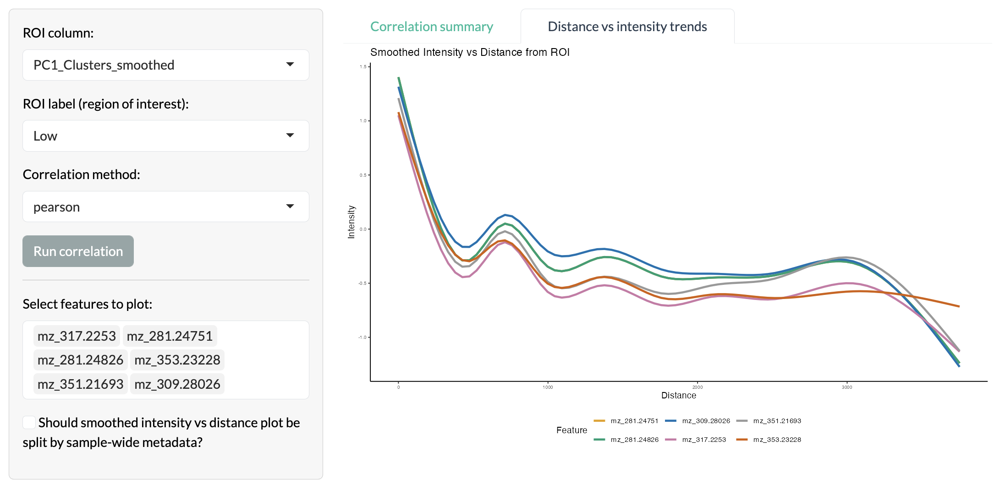

#### Region-based covariation network inference

Pixel-level covariation can be assessed by region using GENIE3 to infer covariation networks between peaks within each region. This allows users to identify relationships between peaks that are specific to certain spatial regions, which may indicate shared biological functions or regulatory relationships that are spatially organised. Users can select a set of target peaks and the top n most covarying peaks with these targets will be identified and visualised in a network where nodes represent peaks and edges represent covariation relationships between peaks. Covariation networks across multiple regions can be compared to identify relationships that are specific to certain regions or shared across regions. Target peaks are shown in blue, while overlapping peaks between networks are shown in green and non-overlapping peaks are shown in grey.

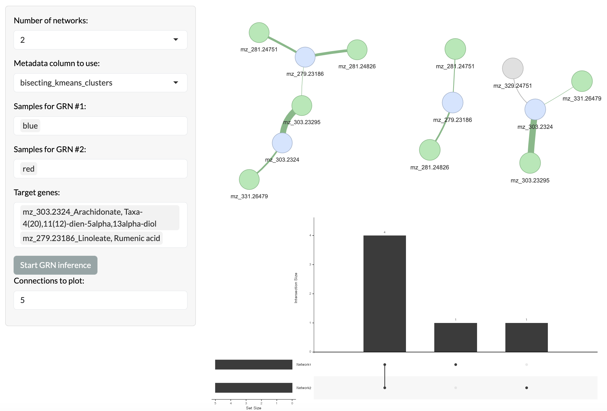

### Pixel-level analysis tabs

To fully leverage the spatial resolution of MSI data, SMEW also provides pixel-level analysis tabs which allow users to explore spatial patterns of metabolic variation at the level of individual pixels. This includes identifying spatially autocorrelated peaks, exploring cross-correlation between peaks across space and performing spatial enrichment analysis to identify pathways that show spatially organised patterns of variation.

#### Spatial autocorrelation and cross-correlation

SMEW uses a spatial autocorrelation approach based on the *semla* method to identify peaks that show spatially refined patterns of variation across the tissue. This allows users to identify peaks which show distinct spatial structure, which may indicate spatially organised metabolic activity. During the preprocessing step, users can specify the number of top autocorrelated peaks to keep for downstream analysis. 

In this tab, you can visualise the autocorrelation scores of peaks across samples and compare the significantly autocorrelated peaks through upset plots. Bar plots show the number of samples where each peak is significantly autocorrelation and each bar is annotated by the bulk-level differential intensity analysis status (if previously run by the user). This allows users to understand which peaks show consistent spatial patterns across samples and how this relates to overall changes in peak abundance across conditions.

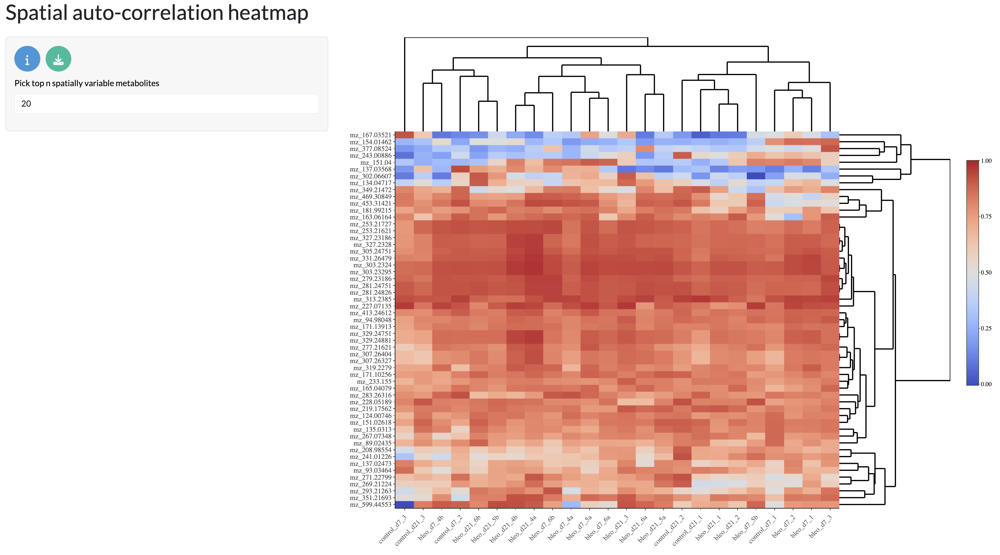
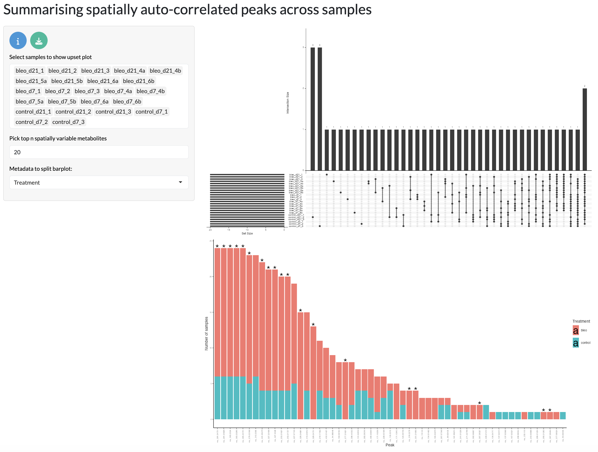

The spatial patterns of multiple peaks can then be compared through cross-correlation analysis. This can be visualised through a heatmap of cross-correlation scores between peaks and an interactive table showing the top cross-correlated peaks for each peak of interest. This allows users to identify pairs of peaks that show similar spatial patterns, which may indicate shared biological functions or regulatory relationships that are spatially organised.
These cross-correlation scores can be used to form hierarchical clusters of peaks based on their spatial patterns from which combined module scores can be calculated and visually explored across space. This allows users to identify clusters of peaks that show similar spatial patterns and explore how these patterns relate to tissue structure and experimental conditions. 

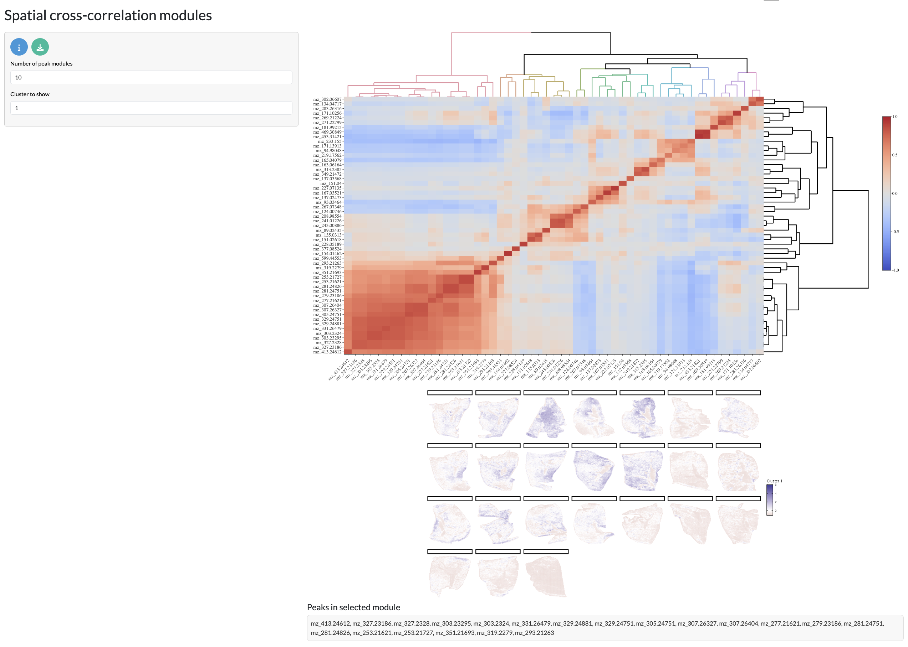


Finally, cross-correlation networks can be formed between peaks based on their spatial patterns, where nodes represent peaks and edges represent cross-correlation relationships between peaks. This allows users to explore the relationships between peaks based on their spatial patterns and identify clusters of related peaks that may be relevant to their biological question. The network can use the top cross-correlation scores overall or top connections per peak and users can specify the number of connections to use for network formation.

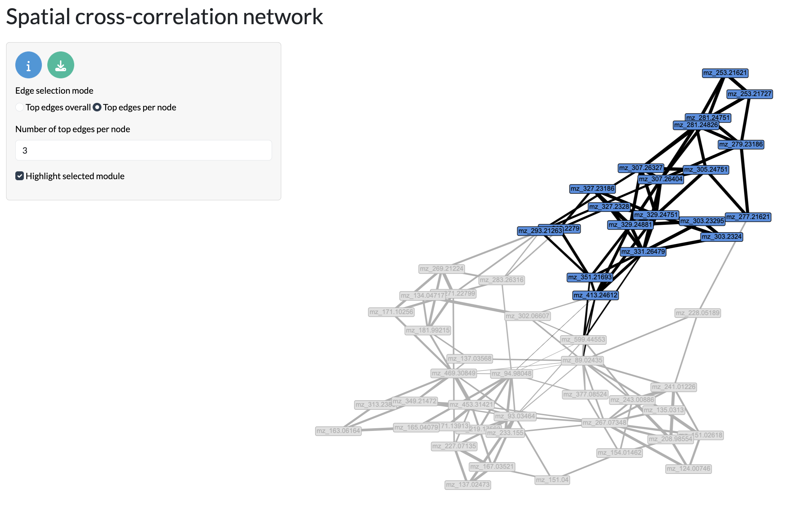

#### Spatial enrichment

The final tab of the SMEW app allows users to visualise the results of spatial enrichment analysis, where pathway enrichment analysis is performed at the pixel level using each pixels neighbours as replicates to highlight changing metabolites and consequently to identify pathways that show spatially organised patterns of variation across the tissue. This is done using the same ORA method as in the bulk-level analysis but applied to each pixel separately, using the annotations of peaks and the intensities of peaks across pixels. During preprocessing, users can specify the samples to use as controls for the enrichment analysis and the samples to test against these controls. The results of this analysis can be visualised through spatial distribution of adjusted p-values or -log10-tranformed p-values. This allows users to identify pathways that show significant spatial patterns of variation across the tissue, which may be relevant to spatially organised metabolic activity.

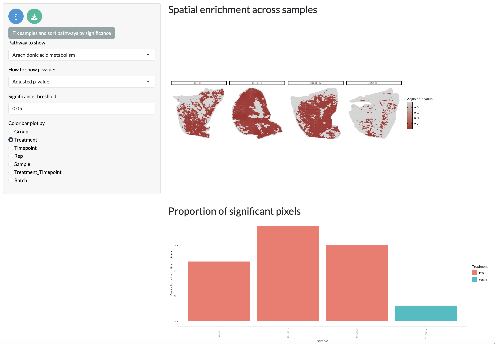
